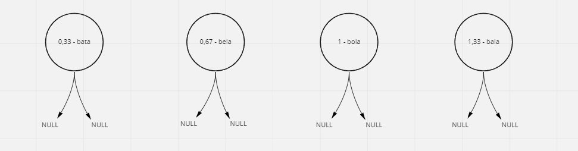
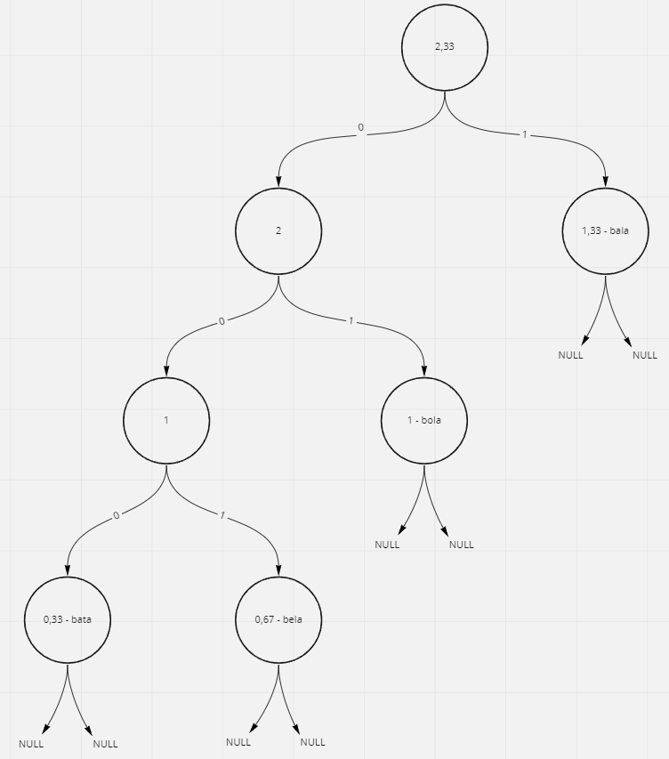
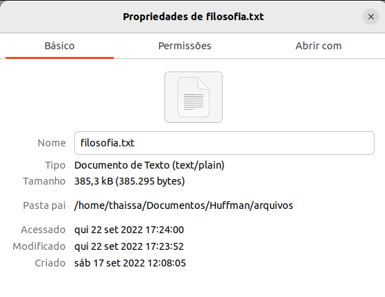
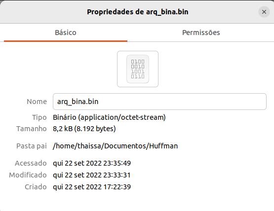

# Código de Huffman


[](https://code.visualstudio.com/docs/?dv=linux64_deb)

## Sumário

<!--ts-->
   * [Problema Proposto](#problema-proposto)
   * [Codificação de Huffman](#codificação-de-huffman)
   * [Lógica](#lógica)
   * [Resultados e Análises](#bibliotecas)
   * [Bibliotecas](#bibliotecas)
   * [Compilação e Execução](#compilação-e-execução)
   * [Contato](#contato)
<!--te-->

## Problema Proposto
<div align="justify">Elabore uma árvore binária que utilize o códgio de Huffman para comprimir arquivos. Para tanto:

- Contabilize a recorrência de cada palavra (RP) no arquivo;
- Normalize a contabilização entre 0 e 1 utilizando a fórmula:

$$ normalização=\frac{recorrência\ da\ palavra}{máxima\ recorrência\ do\ arquivo-mínima \ recorrência \ do\ arquivo}$$
- Monte a árvore com as regras apresentadas por Huffman;
- Troque as palavras pela codificação binária (utilizar booleano para representar 0 e 1);
- Salve o arquivo em formato binário e observe qual foi o ganho de espaço obtido.
</div>

## Codificação de Huffman

A codificação de Huffman é um método de compactação que usa as probabilidades de ocorrência dos símbolos no conjunto de dados a ser compactado para determinar códigos de tamanha variável para cada símbolo. Ele permite compactar arquivos de texto, ou seja, representar um arquivo de texto A por um arquivo de bits B bem menor. Tudo se passa como se o algoritmo transformasse uma string em uma cadeia de bits.

#### Árvores de Huffman

Uma árvore de Huffman é um árvore binária em que cada nó interno tem dois filhos. Os arcos da esquerda são nmerados com 0 enquanto os da direita com 1. 

<div align="center">

</div>

Na árvore da imagem acima, por exemplo, o código dos caracteres seria:

- A = 0, pois, para chegar em sua folha, devemos ir um arco para esquerda;
- B =  100, pois, para chegar em sua folha, devemos ir um arco para direita e dois para esquerda;
- C = 101, pois, para chegar em sua folha, devemos ir um arco para direita, um para esquerda e depois para direita novamente;
- D = 110, pois, para chegar em sua folha, devemos ir dois arcos para direita e um para esquerda;
- E = 111, pois, para chegar em sua folha, devemos ir três arcos para direita;

Em nossa codificação, por meio da forma de `normalização` citada no [Problema Proposto](#problema-proposto), definimos a estrutura inicial da nossa árvore. Supondo por exemplo que temos um arquivo preenchido com o seguinte texto: "bola bala bela bala bata bala bela bola bala bola", a maior recorrência é de 4, da palavra bala, e a menor é de 1, da palavra bata. Aplicando a fórmula, teríamos os seguintes valores:

 $$bata\ =\ \frac{1}{4-1}=\frac{1}{3}=0,33$$

 $$bela\ =\ \frac{2}{4-1}=\frac{2}{3}=0,67$$

 $$bola\ =\ \frac{3}{4-1}=\frac{3}{3}=1$$
 
 $$bala=\ \frac{4}{4-1}=\frac{4}{3}=1,33$$

Comparando e ordenando nosso valores teríamos as seguintes árvores:

<div align="center">

</div>

É construída uma árvore, onde o filho direito é a subávore com menor valor e o direito com o segundo menor valor, e a raiz dessa árvore recebe o valor da soma dos dois outros valores. Esse processo é repetido até que haja apenas uma árvore. Essa será a árvore usada para a codificação.
No fim, temos a seguinte árvore:

<div align="center">

</div>

Então, seguindo as regras já vistas, cada palavra será associada a uma sequência de bits.

- bala = 1;
- bola = 01;
- bela = 001;
- bata = 000;

Essa lógica foi reproduzida no presente algoritmo, porém com um arquivo com mais palavras, para que a dirença de espaço necessário para o armazenamento do arquivo seja mais visível.


## Lógica

### recorrencia.hpp e recorrencia.cpp

Há uma classe Token, a qual foi implementada para evitar problemas com variáveis globais, que contém as seguintes estruturas e funções:

```C++ 
class Token
{
public:
    vector<string>Arquivo;///palavras ja tokenizadas
    map<string, int> StpWrds;///Stop Words
    map<string,int> ArquivoSemStp; /// Arquivo sem stop words
    map<string, float> Hash; ///Arquivo em stop words e com o calculo do normalizaw

    void readFile();
    void preencheStpW();
    void removeStpW(vector<string>&arq);
    void mapWords(map<string,float>&Hash); 
    void imprimirMap();///se necessário imprimir o map já sem as stop words
    float maxMin();///pega rp maximo e minimo
};
```
O vector Arquivo armazenará todo o arquivo "filosofia.txt" na hora da leitura, o map de StpWrds armazenará todas as Stop Words do arquivo "stopwords.txt", o map ArquivoSemStp armazenará todas as palavras que não forem stop words do arquivo e ir suas respectivas recorrências e o map Hash armazenará as palavras que não forem Stop Words, já com seu valor de normalização.

A função readFile() é adaptada da função de tokenização do trabalho sobre TF-IDF, realizado no último semestre [vide git](https://github.com/Kingdrasill/Tokenizacao). O arquivo "filosofia.txt" é aberto e, lendo linha por linha, a medida que se acha um espaço, retira-se os caracteres especiais da string words e posteriormente, inserem-se as palavras no vector Arquivo. Quando finalizado o processo, o arquivo é fechado.

A função preencheStpW() também é adaptada da função de tokenização do trabalho sobre TF-IDF[vide git](https://github.com/Kingdrasill/Tokenizacao). O arquivo "stopwords.txt" é aberto e, lendo linha por linha, inserem-se as stop words no map StpWrds, com um segundo valor 1 só para completar o tipo pair necessário. Quando finalizado o processo, o arquivo é fechado.

A função removeStpW(vector < string > &arq) cria dois iteradores e percorre o vector do Arquivo tentando procurar cada palavra no map se stop words, se não encontra, então insere a palavra no map ArquivoSemStp e no vector arq recebido como parâmetro. Esse vector arq posteriormente será usado na geração de códigos para as palavras e ele é enssa função que ele poderá receber as palavras, sem stop words, na mesma ordem que estão no arquivo. Se a função verifica que a palavra já está no map ArquivoSemStp, ela apenas incrementa sua recorrência.

A função mapWords(map<string,float>&Hash) percorre o map ArquivoSemStp e por meio do segundo parâmetro dele e da função maxMin()(que retorna o denominador da fórmula da normalização), já insere no map Hash a palavra e o valor normalizado.


### tree.hpp e tree.cpp

Esses arquivos apresentam as seguintes estrutura e funções:

```C++ 
struct Record
{
    string key;
    float value;
    string codigo;
};

struct Tree
{
    Record reg;
    Tree *esq, *dir,*pai;
};

void ordena(vector<Tree*>&floresta);
void juntaArvore(vector<Tree*>&floresta);
```
A estrutura Record será o que estará dentro de cada uma das folhas da árvore, que será: a palavra, seu valor normalizado e seu código em funções dos números 0 e 1.

A estrutura Tree tem um Record e três ponteiros, um para seu filho esquerdo, um para o direito e um para o pai.

A função ordena(vector<Tree*>&floresta) usa o método BubbleSort para ordenar as árvores de acordo com o valor de normalização de suas folhas, deixando sempre as com menor valor no final do vector floresta.

A função juntaArvore(vector<Tree*>&floresta) é a que nos da a árvore final, por isso, vamos detalha-lá melhor:

```C++

void juntaArvore(vector<Tree *> &floresta)
{
    Tree *aux_esq,*aux_dir,*paizao;

    while(floresta.size()!=1)
    {
        aux_esq=floresta[floresta.size()-1];
        aux_dir=floresta[floresta.size()-2];

        floresta.pop_back();
        floresta.pop_back();

        paizao=new Tree;
        paizao->esq=aux_esq;
        paizao->dir=aux_dir;
        paizao->reg.value=aux_dir->reg.value+aux_esq->reg.value;
        aux_dir->pai=paizao;
        aux_esq->pai=paizao;
        floresta.push_back(paizao);
        ordena(floresta);      
    }
    floresta[0]->pai=NULL;
}

```
Como já é de conhecimento, o vector floresta estará inicialmente ordenado e pela estrutura da árvore de Huffman, o esquerdo terá que receber a subárvore com menor valor normalizado e o direito com o segundo menor, por isso, cria-se ponteiros auxiliares de árvores para o direito e o esquerdo e atribui-se para eles as árvores com menores valores normalizados, ou seja, as duas últimas do vector floresta. Depois, retira-se essas duas árvores com os dois pop_backs e configura-se o pai. O pai receberá como filho esquerdo o auxiliar esquerdo, como filho direito o auxiliar direito e como valor de normalização as somas dos dois filhos. Defini-se o pai dos dois auxiliares como a nova árvore e então, podemos inserir a nova árvore no vector de árvores floresta e ordena-se eles novamente.
Esse processo é repetido até que o vector floresta tenha tamanho 1, ou seja, quando o vector tem apenas uma árvore com todas as subárvores, o loop é interrompido e, como a última árvore não tem um pai, e está localizada na posição 0 do vector, seu ponteiro pai é igualado a NULL.

### fila.hpp e fila.cpp

O arquivos fila são adaptados dos existentes no repositório de árvores binárias do professor Michel [vide git](https://github.com/mpiress/basic_tree). As funções relevantes a serem explicadas são:

```C++
void widthPath(Tree *t);
void fazCod(Tree** t); //gera os códigos
string procuraCod(Tree** t,string palavra); ///procura código
void preencheCod(vector<string>&codigosf,Tree**t,vector<string>&arq); //preenche o vector códigos de acordo com a sequencia de palavras do arquivo

```
  
A função widthPath(Tree *t) utiliza a estrutura fila para percorrer a árvore em largura imprimindo o código de cada Record.
  
A função fazCod(Tree **t) utilizada o mesmo método da anterior para percorrer a árvore, porém montando os códigos de cada um dos nós, seguindo a regra de que, esquerda concatena "0" e direita "1".
  
A função procuraCod(Tree **t, string palavra) também o mesmo método das duas antecedentes para percorrer a árvore, porém retornando o código da palavra desejada. 
  
A função preencheCod(vector<string>&codigosf,Tree**t,vector<string>&arq) preenche o vector de códigosf, que será usado para passar o arquivo para binário na ordem do original. Ela anda pelo vector arq, preenchido na função removeStpW(vector<string>&arq) do arquivo de reccorência e da push_back no vector com a string do código retornada pela função procuraCod(Tree **t, string palavra) para cada palavra do arquivo "filosofia.txt".
  
### main.cpp
  
Na main, depois de incluído os hpps, é criado um vector de árvores nomeado floresta, uma árvore auxiliar e dois vector de strings, um para armazenar todas as palavras do arquivo(exceto stop words) e o outro para armazenar os códigos em função de 0s e 1s. Também é criado um map que recebe o par de dados string e float, que serão a palavra e o valor de normalização dela.
É instanciada a classe Token e se chama as funções na seguinte ordem para que tudo ocorra bem:
  
  ```C++
  t.readFile(); 
  t.preencheStpW();
  t.removeStpW(arq);
  t.mapWords(Hash);

```
  
 Depois disso, preenche-se o vector floresta com as árvores iniciais, que são as palavras tokenizadas.
  
  ```C++
  for (auto item: Hash ){
    aux= new Tree;
    aux->reg.key=item.first;
    aux->reg.value=item.second;
    aux->dir=NULL;
    aux->esq=NULL;
    floresta.push_back(aux);
  }
```
  Então, são chamadas as funções para compactar a floresta, codificar as folhas e preencher os códigos na ordem do arquivo.
  
  ```C++
  juntaArvore(floresta); ////transforma todas as arvores em uma so

  fazCod(&floresta[0]); /// codifica as folhas

  preencheCod(codigosf,&floresta[0],arq); ///preenche os codigos na ordem do arquivo
```  
  Por último, com a função fwrite(), escrevemos o conteúdo do vector de códgios para o arquivo binário e o programa é encerrado.
  
  ```C++
  FILE *arq_bin;

  arq_bin=fopen("arq_bina.bin","wb");

  fwrite(&codigosf,sizeof(string),codigosf.size(),arq_bin);
```  
  
## Resultados e Análises
  
Como o arquivo contém muitas palavras, sua impressão não fica completa, mas se necessário, pode-se usar a funçõe width path para imprimir a árvore final.
Sobre a compressão, pode-se observar que o arquivo binário gerado após a execução do programa diminuiu cerca de 375kb no espaço necessário para armazenamento. Provando a eficácia da compressão de arquivos por meio da codicação de Huffman. As imagens abaixo mostram as propriedades dos arquivos:
  
 <div align="center">
   
 </div>
  
   <div align="center">
   Propriedades do arquivo texto, ocupa 385,9kb de espaço na memória.
 </div>
  
  <p></p>
  
   <div align="center">   
   
  </div>
  
  <div align="center">   
   Arquivo binário comprimido, ocupa 8,2kb de espaço na memória.
  </div>

## Bibliotecas
- iostream
- iomanip 
- fstream  
- string.h
- vector  
- stdio.h
- sstream
- map
- algorithm
  
## Compilação e Execução

<div align="justify">
O algoritmo disponibilizado possui um arquivo Makefile que realiza todo o procedimento de compilação e execução. Para tanto, temos as seguintes diretrizes de execução:
</div>
<p></p>
<div align="center">

| Comando                |  Função                                                                                           |                     
| -----------------------| ------------------------------------------------------------------------------------------------- |
|  `make clean`          | Apaga a última compilação realizada contida na pasta build                                        |
|  `make`                | Executa a compilação do programa utilizando o gcc, e o resultado vai para a pasta build           |
|  `make run`            | Executa o programa da pasta build após a realização da compilação                                 |
|  `make m`              | Executa o make e o make run.                                                                      |
|  `make r`              | Executa make clean, make e make run        .                                                      |
</div>

## Contato

<div>
<p align="justify"> Thaissa Vitória</p>
<a href="https://t.me/thaissadaldegan">
 

<a href="https://www.linkedin.com/in/thaissa-vitoria-daldegan-6a84b9153/">

</a>
</div>
